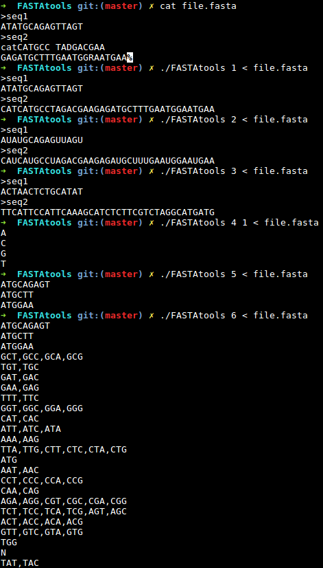

# FASTAtools
Epitech first year project : FASTAtools

Deadline : 5 days

Beginning of the project : 20/06/2016, 08h00

Group size : 1 person

# FASTAtools

FASTA is a file format often used in bioinformatics. It consists in matching identifiers and DNA sequencies.

The identifier is declared on a line starting with the > symbol. The following filled lines, which do not start with >, contain the DNA sequence.

Read a FASTA file from the standard input, and write the DNA sequences to the standard output, while complying with the FASTA format

* [FASTA format](https://en.wikipedia.org/wiki/FASTA_format)

## Getting started

These instructions will allow you to obtain a copy of the operational project on your local machine for development and testing purposes.

### Prerequisites

What do you need to install the software and how to install it?

```
gcc
make
```

### Installation

Here's how to start the project on your computer

Clone and go in the directory FASTAtools

Project compilation

```
make
```

Running project

```
./FASTAtools -h
```


## Screenshot



## Build with

* [C](https://en.wikipedia.org/wiki/C_(programming_language))

## Auteurs

* **David Munoz** - [DavidMunoz-dev](https://github.com/davidmunoz-dev)
